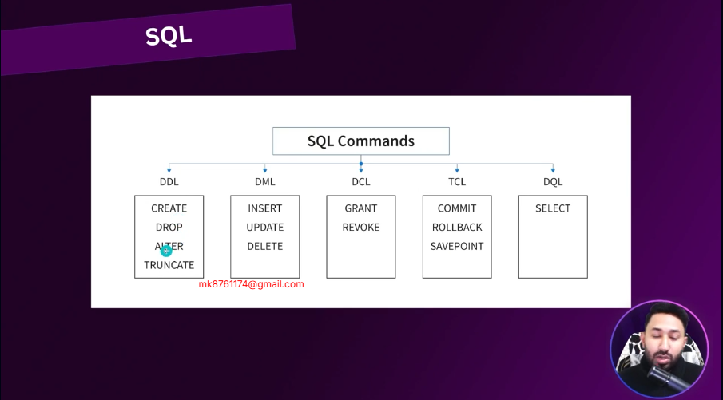

# postgreSQL Essentials
# 7-2 Exploring PSQL and its Default Behavior, Creating Database


- if your command not running for others power shall 
- go to search in window env then click edit then click new and add your path 
- path setting first you go your file manager  c drive check program files click bin folder and copy path name and add in env new file


## change your location 

## summary

| Command                 | Description                     |
| ----------------------- | ------------------------------- |
| `psql -U postgres`      | Start psql with user `postgres` |
| `\l`                    | List databases                  |
| `CREATE DATABASE mydb;` | Create a new database           |
| `\c mydb`               | Connect to a database           |
| `\q`                    | Quit `psql`                     |
##  7-3 User, Role and Privilege Management in POSTGRES.

## switch user1 

insert into table


## 7-4 Granting and Revoking Privileges
if you some power give to user1 apply this command in main postgres then check in child 


# user all permission in user1 table
- postgres=# Grant all privileges on table test_table to user1;
GRANT
- postgres=# create user user2 with encrypted password '123456';
CREATE ROLE
# user read only permission
- postgres=# grant select on table test_table to user2;
GRANT
### power Revoke

postgres=# revoke select on table test_table from user2;
REVOKE
## all public table power
postgres=# grant all privileges on all tables in schema public to user2;
GRANT
postgres=#
## role1 on power give to user3
postgres=# grant select on all tables in schema public to role1;
GRANT
postgres=# create user user3 with encrypted password '123456';
CREATE ROLE
postgres=# grant role1 to user3;
GRANT ROLE
## 7-5 SQL Structured Query Language (SQL)
# 2 type language 1. Declarative 2. imperative 
- 1st Declarative = SQL is a Declarative language i mean you just says you work it enough not need to know how work it 
example Select * from test_table
- 2 imperative every time you says command as like java Script
## ----- sql commands
 
## -------------- Sql Commands------------

## 🗃️ SQL Command Reference

### 🔹 Data Definition Language (DDL)
These commands define the structure of a database.

| Command   | Description                                 |
|-----------|---------------------------------------------|
| CREATE    | Creates a new database/table/index/view     |
| ALTER     | Modifies an existing database object        |
| DROP      | Deletes a database/table/index/view         |
| TRUNCATE  | Removes all records from a table (faster than DELETE) |

```sql
CREATE TABLE users (
  id INT PRIMARY KEY,
  name VARCHAR(100),
  email VARCHAR(100)
);

ALTER TABLE users ADD COLUMN age INT;

DROP TABLE users;
🔹 Data Manipulation Language (DML)
Used for managing data in tables.

Command	Description
SELECT	Retrieves data
INSERT	Inserts new data
UPDATE	Modifies existing data
DELETE	Deletes existing data

sql
Copy
Edit
SELECT * FROM users;

INSERT INTO users (id, name, email)
VALUES (1, 'Munna', 'munna@example.com');

UPDATE users SET name = 'Munna Khan' WHERE id = 1;

DELETE FROM users WHERE id = 1;
🔹 Data Control Language (DCL)
Controls access to data in the database.

Command	Description
GRANT	Gives user access privileges
REVOKE	Removes user access privileges

sql
Copy
Edit
GRANT SELECT, INSERT ON users TO 'username';

REVOKE INSERT ON users FROM 'username';
🔹 Transaction Control Language (TCL)
Manages transactions in a database.

Command	Description
COMMIT	Saves all changes in the transaction
ROLLBACK	Undoes changes since last COMMIT
SAVEPOINT	Sets a save point within a transaction

sql
Copy
Edit
BEGIN;

UPDATE users SET age = 25 WHERE id = 1;

SAVEPOINT sp1;

UPDATE users SET age = 30 WHERE id = 2;

ROLLBACK TO sp1;

COMMIT;
🔹 Filtering & Conditions (used with SELECT)
sql
Copy
Edit
SELECT * FROM users WHERE age > 25;

SELECT name, email FROM users ORDER BY name ASC;

SELECT COUNT(*) FROM users;

SELECT DISTINCT name FROM users;

SELECT * FROM users WHERE name LIKE 'M%';

SELECT * FROM users WHERE age BETWEEN 20 AND 30;
🔹 Joins (Combining multiple tables)
sql
Copy
Edit
-- Inner Join
SELECT users.name, orders.product
FROM users
JOIN orders ON users.id = orders.user_id;

-- Left Join
SELECT users.name, orders.product
FROM users
LEFT JOIN orders ON users.id = orders.user_id;
